# Database Design — Lead OS

**Engine:** PostgreSQL 16 · **Access:** Prisma 6 (+ typed raw SQL for analytics) ·
Traces to: `FR-TEN-4`, `FR-LEAD-*`, `FR-DUP-*`, `FR-TL-*`, `NFR-SCALE-3`, `NFR-PERF-3`

---

## 1. Conventions (apply to every table)

| Rule              | Detail                                                                                                                                                                                                                                              |
| ----------------- | --------------------------------------------------------------------------------------------------------------------------------------------------------------------------------------------------------------------------------------------------- |
| Primary key       | `id UUID` generated as **UUIDv7** in the app (time-ordered ⇒ index locality, no enumerable ints, safe for distributed/offline generation)                                                                                                           |
| Tenant column     | `organization_id UUID NOT NULL` on **every** tenant-scoped table                                                                                                                                                                                    |
| Tenant uniqueness | `UNIQUE (organization_id, id)` on every tenant table — the anchor for composite FKs                                                                                                                                                                 |
| Composite FKs     | Child references use `(organization_id, parent_id) → parent(organization_id, id)`; cross-tenant references become impossible (`FR-TEN-4`)                                                                                                           |
| Timestamps        | `created_at timestamptz NOT NULL DEFAULT now()`, `updated_at timestamptz NOT NULL` (trigger-maintained); business time is always `timestamptz` (UTC stored, org timezone for display/working-hours logic)                                           |
| Soft delete       | `deleted_at timestamptz NULL` on business data (leads, customers, tasks, deals, notes, documents, forms, websites, workflows, users). Partial indexes `WHERE deleted_at IS NULL`. Hard delete only via retention purge or DSR (`FR-PRV-3`, Rule 15) |
| Actor columns     | `created_by_id`, `updated_by_id` (nullable — system/automation writes are `NULL` + `source` enum)                                                                                                                                                   |
| Money             | `amount_minor BIGINT` + `currency CHAR(3)`. **No floats for money, ever**                                                                                                                                                                           |
| Phones            | `phone_e164 VARCHAR(20)` (normalized, indexed) + `phone_raw VARCHAR(32)` (as received)                                                                                                                                                              |
| Enums             | Postgres enums **only** for developer-owned, code-branching values (e.g. `task_status`). Anything a tenant can rename/extend is a **table** (statuses, sources, lost reasons, task types, outcomes, reschedule reasons) — Rules 5–8                 |
| JSONB             | For open-ended structures: custom field values, payloads, configs, metadata. Always validated in the app against a stored schema; never used to dodge modelling a real relationship                                                                 |
| Naming            | `snake_case`, plural tables, `<table>_<cols>_idx` / `_uq` / `_fk`, `_at` for timestamps, `_id` for keys                                                                                                                                             |
| Index prefix      | Every tenant-table index starts with `organization_id` (except global-unique lookups such as `provider_message_id`)                                                                                                                                 |
| Migrations        | Forward-only, reviewed SQL; additive then backfill then switch; no destructive change without a written rollback note                                                                                                                               |

---

## 2. Entity-relationship overview

```mermaid
erDiagram
  PLANS ||--o{ SUBSCRIPTIONS : "sold as"
  ORGANIZATIONS ||--|| SUBSCRIPTIONS : has
  ORGANIZATIONS ||--o{ BRANCHES : has
  ORGANIZATIONS ||--o{ TEAMS : has
  ORGANIZATIONS ||--o{ MEMBERSHIPS : has
  USERS ||--o{ MEMBERSHIPS : "joins via"
  ROLES ||--o{ USER_ROLES : grants
  USERS ||--o{ USER_ROLES : has
  ROLES ||--o{ ROLE_PERMISSIONS : includes
  PERMISSIONS ||--o{ ROLE_PERMISSIONS : "listed in"

  ORGANIZATIONS ||--o{ LEADS : owns
  LEAD_SOURCES ||--o{ LEADS : "origin of"
  CAMPAIGNS ||--o{ LEADS : "attributed to"
  PIPELINES ||--o{ PIPELINE_STAGES : has
  PIPELINE_STAGES ||--o{ LEADS : "current stage"
  LEAD_STATUSES ||--o{ LEADS : "current status"
  USERS ||--o{ LEADS : "assigned to"

  LEADS ||--o{ LEAD_TOUCHPOINTS : accumulates
  LEADS ||--o{ LEAD_ASSIGNMENTS : history
  LEADS ||--o{ LEAD_STAGE_HISTORY : history
  LEADS ||--o{ ACTIVITIES : timeline
  LEADS ||--o{ TASKS : "next actions"
  LEADS ||--o{ NOTES : has
  LEADS ||--o{ DOCUMENTS : has
  LEADS ||--o{ CONVERSATIONS : "talks in"
  LEADS ||--o{ CALLS : has
  LEADS ||--o{ DEALS : "may become"
  LEADS ||--o{ CONSENTS : grants
  LEADS ||--o{ LEAD_DUPLICATES : "flagged with"
  LEADS ||--o| CUSTOMERS : "converts to"

  CONVERSATIONS ||--o{ MESSAGES : contains
  WHATSAPP_NUMBERS ||--o{ CONVERSATIONS : "hosted on"
  WHATSAPP_ACCOUNTS ||--o{ WHATSAPP_NUMBERS : has
  WHATSAPP_TEMPLATES ||--o{ MESSAGES : "rendered into"
  MESSAGES ||--o{ MESSAGE_STATUS_EVENTS : tracked
  MESSAGES ||--o{ MESSAGE_MEDIA : carries

  DEALS ||--o{ DEAL_ITEMS : "lines"
  DEALS ||--o{ QUOTATIONS : quoted
  DEALS ||--o{ PAYMENTS : "paid by"
  CUSTOMERS ||--o{ DEALS : buys

  FORMS ||--o{ FORM_FIELDS : has
  FORMS ||--o{ FORM_SUBMISSIONS : receives
  FORM_SUBMISSIONS ||--o| LEADS : creates
  INBOUND_PAYLOADS ||--o| LEADS : "may create"

  WORKFLOWS ||--o{ WORKFLOW_VERSIONS : versioned
  WORKFLOW_VERSIONS ||--o{ WORKFLOW_STEPS : contains
  WORKFLOW_VERSIONS ||--o{ AUTOMATION_RUNS : executes
  AUTOMATION_RUNS ||--o{ AUTOMATION_RUN_STEPS : logs

  WEBSITES ||--o{ WEBSITE_PAGES : has
  WEBSITES ||--o{ WEBSITE_DOMAINS : "served at"
  WEBSITES ||--o{ WEBSITE_EVENTS : generates
  ANALYTICS_VISITORS ||--o{ ANALYTICS_SESSIONS : has
  ANALYTICS_SESSIONS ||--o{ WEBSITE_EVENTS : contains
  ANALYTICS_VISITORS ||--o{ VISITOR_IDENTITIES : "stitched to"
  VISITOR_IDENTITIES }o--|| LEADS : identifies

  AD_ACCOUNTS ||--o{ CAMPAIGNS : syncs
  CAMPAIGNS ||--o{ AD_ENTITIES : "ad sets/ads"
  CAMPAIGNS ||--o{ CAMPAIGN_DAILY_METRICS : "spend/impr/clicks"
  LEAD_TOUCHPOINTS }o--|| CAMPAIGNS : "attributes to"

  INTEGRATION_CONNECTIONS ||--o{ PROVIDER_EVENTS : receives
  WEBHOOK_ENDPOINTS ||--o{ WEBHOOK_DELIVERIES : sends
  WEBHOOK_DELIVERIES ||--o{ WEBHOOK_ATTEMPTS : retries
  OUTBOX_EVENTS }o--|| ORGANIZATIONS : "emitted by"
```



Full table list follows, grouped by module. Column lists are abbreviated to keys, discriminators and
anything architecturally meaningful; exhaustive columns live in `packages/db/prisma/schema/*.prisma`
once Phase 1 begins.

---

## 3. Platform (non-tenant) tables

These have **no** `organization_id` and are unreachable from tenant routes.

| Table                                | Purpose                          | Key columns / notes                                                                                                     |
| ------------------------------------ | -------------------------------- | ----------------------------------------------------------------------------------------------------------------------- |
| `plans`                              | SaaS plans                       | `code UQ`, name, description, `interval (month                                                                          | year)`, `price_minor`, `currency`, `trial_days`, `is_public`, `sort_order`, `is_active` |
| `plan_features`                      | Limits & flags per plan          | `(plan_id, feature_key) UQ`, `limit_value BIGINT NULL` (NULL = unlimited), `is_enabled BOOL`, `overage_policy`          |
| `features`                           | Catalogue of entitlement keys    | `key UQ`, name, `unit (count                                                                                            | per_month                                                                               | bytes      | bool)`, description — Super Admin editable (`FR-BIL-2`) |
| `platform_settings`                  | Singleton-ish config             | `key UQ`, `value JSONB`, `is_secret`                                                                                    |
| `platform_users`                     | Platform staff                   | Separate from tenant `users`; own MFA requirement                                                                       |
| `industry_templates`                 | Onboarding seeds                 | `code UQ`, industry, `definition JSONB` (fields, pipeline, statuses, sources, views, automations, WA template drafts)   |
| `website_templates`                  | Site templates                   | `code UQ`, industry, thumbnail, `schema JSONB`, `is_active`                                                             |
| `service_packages`                   | Marketing/dev services catalogue | `code`, type (`seo                                                                                                      | meta_ads                                                                                | google_ads | website                                                 | landing_page | content | social`), `price_minor`, `billing_cycle`, `deliverables JSONB` |
| `coupons`                            | Discounts                        | code, type, value, limits, validity                                                                                     |
| `platform_audit_logs`                | Platform-actor audit             | append-only                                                                                                             |
| `impersonation_sessions`             | Support impersonation            | `platform_user_id`, `organization_id`, `target_user_id`, reason, `started_at`, `ended_at`, `actions_count` (`FR-TEN-7`) |
| `support_tickets`, `ticket_messages` | Support                          | org, reporter, status, priority, SLA                                                                                    |
| `feature_flags`                      | Platform/tenant rollout          | `key`, `scope (global                                                                                                   | org)`, `rules JSONB`, percentage rollout                                                |
| `job_failures`                       | DLQ mirror for Super Admin       | queue, job name, payload (redacted), error, attempts, `retried_at` (`FR-SA-4`)                                          |
| `system_health_checks`               | Probe results                    | component, status, latency_ms, checked_at, detail                                                                       |

---

## 4. Organization, identity & access

| Table                                    | Purpose                                                | Key columns / notes                                                                                                                                                                                                                                                                           |
| ---------------------------------------- | ------------------------------------------------------ | --------------------------------------------------------------------------------------------------------------------------------------------------------------------------------------------------------------------------------------------------------------------------------------------- |
| `organizations`                          | Tenant root                                            | `slug UQ`, name, legal_name, industry, `country`, `timezone`, `default_currency`, `default_phone_country`, `status (trialing                                                                                                                                                                  | active | past_due                                                                       | grace                                   | suspended                                                                                                                                                                                                                                                                                                                                                                                               | cancelled)`, `public_key UQ`, `logo_url`, `settings JSONB`, `onboarding_state JSONB`, `deleted_at` |
| `branches`                               | Locations                                              | org, name, code, address, timezone, `is_default`                                                                                                                                                                                                                                              |
| `teams`                                  | Groups                                                 | org, name, `manager_id`, `branch_id`                                                                                                                                                                                                                                                          |
| `team_members`                           | Membership                                             | `(organization_id, team_id, user_id) UQ`, `is_lead`                                                                                                                                                                                                                                           |
| `users`                                  | **Global identity** (platform table, ADR-0012)         | `email` (`UNIQUE (organization_id, lower(email))`), `password_hash` (Argon2id), name, `phone_e164`, avatar, `status (invited                                                                                                                                                                  | active | disabled)`, `timezone`, `locale`, `last_login_at`, `mfa_enabled`, `deleted_at` |
| `memberships`                            | **Tenant anchor for a person** (multi-org, `FR-IAM-6`) | `(organization_id, user_id) UQ`, `(organization_id, id) UQ`, status, `default_branch_id`, `is_owner`, `joined_at`. Every tenant row referencing a person references **this** by `(organization_id, user_id)`, so work cannot be assigned to a non-member — the database rejects it (ADR-0012) |
| `roles`                                  | Per-org roles                                          | `(organization_id, code) UQ`, name, `is_system`, `is_editable`, description                                                                                                                                                                                                                   |
| `permissions`                            | Catalogue (platform-level)                             | `key UQ` e.g. `lead:read`, `module`, `description`, `supports_scope BOOL`                                                                                                                                                                                                                     |
| `role_permissions`                       | Grants                                                 | `(role_id, permission_key) UQ`, `scope (own                                                                                                                                                                                                                                                   | team   | branch                                                                         | organization)` (`FR-IAM-4`)             |
| `user_roles`                             | Assignment                                             | `(organization_id, user_id, role_id) UQ`                                                                                                                                                                                                                                                      |
| `invitations`                            | Onboarding                                             | email, role, team, branch, `token_hash`, `expires_at`, `accepted_at`                                                                                                                                                                                                                          |
| `sessions`                               | Refresh sessions                                       | `user_id`, `refresh_token_hash`, `family_id`, `prev_id` (rotation/reuse detection), device, ip, ua, `expires_at`, `revoked_at`                                                                                                                                                                |
| `password_resets`, `email_verifications` | Token flows                                            | `token_hash`, `expires_at`, `used_at`                                                                                                                                                                                                                                                         |
| `mfa_secrets`, `mfa_recovery_codes`      | TOTP                                                   | encrypted secret, `code_hash`                                                                                                                                                                                                                                                                 |
| `working_hours`                          | Per org/branch/user                                    | `scope`, `owner_id`, `day_of_week`, `start_time`, `end_time`, timezone                                                                                                                                                                                                                        |
| `holidays`                               | Calendar                                               | org/branch, date, name, `is_working`                                                                                                                                                                                                                                                          |
| `user_availability`                      | Leave/status                                           | user, `state (available                                                                                                                                                                                                                                                                       | busy   | leave                                                                          | offline)`, from/to, reason (`FR-IAM-8`) |
| `audit_logs`                             | Tenant audit, append-only                              | org, `actor_type (user                                                                                                                                                                                                                                                                        | system | automation                                                                     | platform                                | api_key)`, actor_id, action, `resource_type`, `resource_id`, `before JSONB`, `after JSONB`, ip, user_agent, request_id, `created_at`. Append-only **enforced by trigger**: UPDATE always rejected, DELETE only inside a transaction setting `app.audit_purge='on'`(the retention/DSR path,`withAuditPurge()`). Organization FK is `RESTRICT` so no cascade can erase the trail (`FR-AUD-2`, `FR-PRV-3`) |

---

## 5. Custom fields (the metadata engine)

**Decision (ADR-0005): JSONB-on-row, driven by a definition table.** Rejected: per-tenant columns
(violates Rule 5, unbounded DDL), classic EAV (one join per displayed field; 30-field list view =
unusable), separate table per type (same join problem).

| Table                      | Purpose       | Key columns                                                         |
| -------------------------- | ------------- | ------------------------------------------------------------------- |
| `custom_field_sections`    | UI grouping   | org, `entity_type`, name, sort_order, `collapsed_by_default`        |
| `custom_field_definitions` | The metadata  | org, `entity_type (lead                                             | customer | deal | task | conversation)`, `key` (`UNIQUE (organization_id, entity_type, key)`, immutable after create), `label`, `type`, `placeholder`, `help_text`, `is_required`, `default_value JSONB`, `validation JSONB`(min/max/regex/precision/maxLength/fileTypes/maxSizeKb),`section_id`, `sort_order`, `visibility JSONB`(role/stage conditions),`show_in_list`, `is_searchable`, `is_filterable`, `is_indexed`, `is_pii`, `is_active`, `deleted_at` |
| `custom_field_options`     | Choice values | `(definition_id, value) UQ`, label, colour, sort_order, `is_active` |

Values live on the owning row:

```sql
ALTER TABLE leads ADD COLUMN custom_values     JSONB NOT NULL DEFAULT '{}'::jsonb;
ALTER TABLE leads ADD COLUMN custom_search_text TEXT;  -- concatenated searchable values

CREATE INDEX leads_custom_values_gin
  ON leads USING GIN (custom_values jsonb_path_ops);

-- Hot-path fields get a real index, created by a controlled admin job when
-- is_indexed = true on the definition (expression index, no schema change to the table shape):
CREATE INDEX leads_cv_budget_idx
  ON leads ((custom_values->>'budget')) WHERE deleted_at IS NULL;
```

Rules:

- The API **never** trusts client-sent keys: the values object is validated against active
  definitions; unknown keys are rejected (or quarantined on ingestion, `FR-CAP-5`).
- Types are stored canonically inside JSONB: numbers as JSON numbers, dates as ISO-8601 strings,
  currency as `{ "amount_minor": 500000000, "currency": "INR" }`, files as `{ documentId, name, size, mime }`.
- `is_indexed = true` triggers an admin job that creates the expression index concurrently; the
  definition records the index name so it can be dropped on deactivation. Filterable-but-unindexed
  fields still work via the GIN index.
- Deleting a definition is a soft delete; values are retained until retention purge so history and
  audit remain truthful.
- `custom_search_text` is maintained on write and included in the search `tsvector`.

---

## 6. Leads & CRM core

### 6.1 `leads`

```
id, organization_id, branch_id?, team_id?, assigned_user_id?,
first_name, last_name, full_name (application-maintained*), company, job_title?,
phone_e164?, phone_raw?, whatsapp_e164?, email?,
city?, state?, country?, postal_code?, timezone?,
lead_source_id?, campaign_id?, ad_entity_id?, form_id?, website_id?, landing_page_url?,
utm JSONB,                       -- source/medium/campaign/term/content/gclid/fbclid
status_id, pipeline_id, stage_id, priority (enum: low|medium|high|urgent),
score INT DEFAULT 0, score_band?,
value_minor BIGINT?, currency CHAR(3)?,
custom_values JSONB, custom_search_text TEXT, search_vector tsvector,
first_contacted_at?, last_contacted_at?, last_activity_at?,
next_action_at?, next_action_task_id?,       -- denormalized for the Today view
open_tasks_count INT, reschedule_count INT, touch_count INT,
sla_first_response_due_at?, sla_first_response_at?, sla_state (ok|at_risk|breached),
converted_at?, customer_id?, lost_reason_id?, lost_note?,
is_duplicate_of_id?, merged_into_id?,
consent_whatsapp BOOL, consent_email BOOL, consent_calls BOOL,
created_by_id?, created_via (manual|form|api|webhook|import|whatsapp|meta_ads|google_ads|website),
created_at, updated_at, deleted_at
```

\* _Deviation:_ `full_name` is maintained by the application rather than being a generated column, for
the same reason `updated_at` is not a trigger (§16.10) — Prisma sends every column it knows about and
would fight a generated one. It is derived in one place (`buildFullName`) and falls back to the company,
the email, then the phone number, because an unnamed enquiry from a phone number is still a lead.

**Columns deferred to the step that brings their table.** `customer_id`, `campaign_id`, `ad_entity_id`,
`form_id`, `website_id`, `next_action_task_id`, `is_duplicate_of_id`, `merged_into_id`,
`sla_first_response_*` and `sla_state` are absent from the Phase 2 step-1 schema rather than present as
unconstrained uuids: a nullable id with no foreign key is a column nothing can trust. They arrive with
`customers`, `campaigns`, `forms`, `websites`, `tasks`, `lead_duplicates` and `sla_policies`
respectively. `score` and `score_band` **are** present, because the columns are scalars and the scoring
engine writes them without a new table.

Indexes (all `WHERE deleted_at IS NULL` where applicable):

```sql
UNIQUE (organization_id, id)                                    -- composite-FK anchor
(organization_id, created_at DESC)                              -- default list
(organization_id, assigned_user_id, next_action_at)             -- executive Today view
(organization_id, stage_id, updated_at DESC)                    -- kanban columns
(organization_id, status_id)
(organization_id, phone_e164)          -- duplicate detection + search
(organization_id, whatsapp_e164)
(organization_id, lower(email))
(organization_id, lead_source_id, created_at)                   -- source reports
(organization_id, campaign_id, created_at)                      -- campaign reports
(organization_id, score DESC)
(organization_id, sla_state, sla_first_response_due_at)         -- SLA board
(organization_id, last_activity_at)                             -- ageing / recycling
GIN (search_vector)                                             -- global search
GIN (custom_values jsonb_path_ops)
Partial: (organization_id, assigned_user_id) WHERE next_action_at IS NULL AND status open
                                                                -- "no next action" detection
```

### 6.2 Supporting lead tables

| Table                                       | Purpose                 | Notes                                                                                                                                                                                                                                                                                                         |
| ------------------------------------------- | ----------------------- | ------------------------------------------------------------------------------------------------------------------------------------------------------------------------------------------------------------------------------------------------------------------------------------------------------------- |
| `lead_statuses`                             | Tenant-defined statuses | org, name, colour, `category (open                                                                                                                                                                                                                                                                            | won    | lost                                        | invalid)`, sort_order, `is_default` |
| `lead_sources`                              | Tenant-defined sources  | org, name, `type`, `integration_connection_id?`, `cost_model`, `is_active`; reports join cost & revenue (`FR-LEAD-7`, §8 of PRD)                                                                                                                                                                              |
| `lost_reasons`                              | Tenant-defined          | org, name, sort_order, `requires_note`                                                                                                                                                                                                                                                                        |
| `tags`, `lead_tags`                         | Free tagging            | `(organization_id, lead_id, tag_id) UQ`                                                                                                                                                                                                                                                                       |
| `lead_touchpoints`                          | **Attribution spine**   | org, lead_id, `sequence INT`, `occurred_at`, `channel`, `lead_source_id?`, `campaign_id?`, `ad_entity_id?`, `form_id?`, `website_id?`, `landing_page_url?`, `utm JSONB`, `session_id?`, `cost_attributable BOOL`, `metadata JSONB`. **Never overwritten** — a second capture appends (`FR-DUP-3`, `FR-ATT-1`) |
| `lead_assignments`                          | Assignment history      | org, lead_id, `from_user_id?`, `to_user_id?`, `to_team_id?`, `assigned_by_id?`, `assignment_rule_id?`, `reason`, `created_at` (`FR-ASG-5`)                                                                                                                                                                    |
| `lead_status_history`, `lead_stage_history` | Transitions             | from, to, `changed_by_id?`, `duration_seconds` (time spent in previous), `created_at`                                                                                                                                                                                                                         |
| `lead_score_events`                         | Score explainability    | rule_id, delta, reason, `score_after`, created_at (`FR-SCR-2`)                                                                                                                                                                                                                                                |
| `lead_duplicates`                           | Detected candidates     | org, `lead_id`, `duplicate_lead_id`, `rule_id`, `match_fields JSONB`, `confidence`, `status (open                                                                                                                                                                                                             | merged | dismissed)`                                 |
| `lead_merges`                               | Merge record            | org, `surviving_lead_id`, `merged_lead_id`, `field_choices JSONB`, `performed_by_id`, `undone_at?`, snapshot for reversal (`FR-DUP-4`)                                                                                                                                                                        |
| `duplicate_rules`                           | Matching config         | org, name, `match_on JSONB` (fields/composites), `lookback_days`, `action`, `priority`, `is_active`                                                                                                                                                                                                           |
| `customers`                                 | Converted               | org, `lead_id?`, name, phones, email, billing info, `lifetime_value_minor`, `first_purchase_at`, `segment_ids`, custom_values, deleted_at                                                                                                                                                                     |
| `customer_merges`                           | As per leads            | —                                                                                                                                                                                                                                                                                                             |
| `saved_views`                               | Filters/views           | org, owner_id?, `entity_type`, name, `filters JSONB`, `columns JSONB`, `sort JSONB`, `visibility (private                                                                                                                                                                                                     | team   | org)`, `is_default_for_role?` (`FR-VIEW-3`) |

### 6.3 Pipelines, assignment, scoring

| Table                        | Key columns                                                                                                                                                            |
| ---------------------------- | ---------------------------------------------------------------------------------------------------------------------------------------------------------------------- |
| `pipelines`                  | org, name, `entity_type (lead                                                                                                                                          | deal)`, `is_default`, is_active |
| `pipeline_stages`            | org, pipeline_id, name, colour, `sort_order`, `probability SMALLINT`, `is_won`, `is_lost`, `required_fields JSONB`, `target_duration_hours?`, `automation_hooks JSONB` |
| `assignment_rules`           | org, name, `priority INT`, `is_active`, `strategy (specific_user                                                                                                       | team                            | round_robin | weighted_round_robin | least_open_leads | top_performer)`, `target JSONB`, `respect_working_hours BOOL`, `capacity_cap?`, `fallback JSONB` |
| `assignment_rule_conditions` | rule_id, `field_path`, `operator`, `value JSONB`, `group_index` (AND within group, OR across groups)                                                                   |
| `assignment_pool_members`    | rule_id, user_id, `weight`, `is_active`                                                                                                                                |
| `round_robin_state`          | `(organization_id, rule_id) UQ`, `cursor_index`, `last_assigned_user_id`, `updated_at` (Redis is the fast path; this row is the durable truth)                         |
| `scoring_rules`              | org, name, `trigger_event`, `conditions JSONB`, `points INT`, `max_applications?`, `decay JSONB?`, is_active                                                           |
| `score_bands`                | org, name, `min_score`, `max_score`, colour                                                                                                                            |

### 6.4 Tasks, SLA, activities

| Table                | Key columns                                                                                                                                                                                                                                  |
| -------------------- | -------------------------------------------------------------------------------------------------------------------------------------------------------------------------------------------------------------------------------------------- |
| `tasks`              | org, `lead_id?`, `customer_id?`, `deal_id?`, `conversation_id?`, title, description, `task_type_id`, `due_at timestamptz`, `due_date date` + `due_time time` (for org-timezone day grouping), priority, `assigned_user_id`, `status (pending | in_progress                                                                                        | completed                                                                                                        | cancelled | rescheduled)`, `completed_at?`, `outcome_id?`, `completion_note?`, `reminder_offsets JSONB`, `created_via`, `automation_run_id?`, `rescheduled_from_task_id?`, `reschedule_count`, deleted_at |
| `task_types`         | org, name, icon, `default_duration_minutes`, `default_reminder_offsets`, is_active                                                                                                                                                           |
| `task_reschedules`   | org, task_id, `from_due_at`, `to_due_at`, `reason_id`, `reason_note?`, `rescheduled_by_id`, created_at (`FR-TSK-5`)                                                                                                                          |
| `reschedule_reasons` | org, name, sort_order, `requires_note`, is_active (seeded with the brief's list, editable)                                                                                                                                                   |
| `task_reminders`     | task_id, `remind_at`, `channel`, `sent_at?`, `job_id?`                                                                                                                                                                                       |
| `sla_policies`       | org, name, `applies_to JSONB` (source/priority/pipeline/score band), `first_response_minutes`, `next_response_minutes?`, `resolution_minutes?`, `business_hours_only BOOL`, `escalate_to JSONB`, is_active                                   |
| `sla_clocks`         | org, `subject_type (lead                                                                                                                                                                                                                     | conversation                                                                                       | task)`, `subject_id`, `policy_id`, `started_at`, `due_at`, `paused_ms`, `satisfied_at?`, `breached_at?`, `state` |
| `escalations`        | org, subject, `policy_id`, `level`, `notified_user_ids`, `created_at`, `acknowledged_at?`                                                                                                                                                    |
| `activities`         | **Append-only timeline.** org, `lead_id?`, `customer_id?`, `deal_id?`, `conversation_id?`, `type` (see §6.5), `actor_type`, `actor_id?`, `occurred_at timestamptz`, `payload JSONB`, `visibility (all                                        | internal)`, `source_event_id?`(idempotency),`created_at`. **Partitioned monthly by `occurred_at`** |
| `notes`              | org, subject, `body`, `is_internal`, `mentions UUID[]`, author, deleted_at                                                                                                                                                                   |
| `mentions`           | org, note_id/message_id, `mentioned_user_id`, `read_at?`                                                                                                                                                                                     |
| `documents`          | org, subject, `file_key`, `file_name`, `mime_type`, `size_bytes`, `checksum`, `scan_status (pending                                                                                                                                          | clean                                                                                              | infected)`, uploaded_by, deleted_at                                                                              |

`activities` indexes: `(organization_id, lead_id, occurred_at DESC)`,
`(organization_id, type, occurred_at DESC)`, `(organization_id, actor_id, occurred_at DESC)`,
`UNIQUE (organization_id, source_event_id)` (nulls allowed) — the last one is what makes timeline
writes idempotent under job retries (`FR-TL-1`, `NFR-REL-4`).

### 6.5 Activity type registry (code constant, not a DB enum)

`lead.created`, `lead.source_captured`, `lead.assigned`, `lead.reassigned`, `lead.status_changed`,
`lead.stage_changed`, `lead.score_changed`, `lead.field_updated`, `lead.merged`, `lead.duplicate_detected`,
`lead.converted`, `lead.lost`, `lead.recycled`,
`task.created|completed|rescheduled|cancelled|overdue`,
`call.logged|missed`, `whatsapp.sent|received|failed|template_sent|read`,
`email.sent|opened|clicked|bounced`, `note.added`, `mention.created`, `document.uploaded`,
`quotation.sent`, `deal.created|won|lost`, `payment.received`,
`website.session|page_view|product_view|cta_click|whatsapp_click|checkout_started|purchase`,
`marketing.touchpoint_added`, `automation.enrolled|action_executed|skipped|failed|exited`,
`sla.at_risk|breached`, `consent.granted|revoked`, `conversation.assigned|transferred|closed|reopened`,
`ai.summary_generated|suggestion_generated`.

Adding a type = adding a constant + a renderer in the UI registry. No migration (`FR-TL-3`).

### 6.6 Deals, quotations, payments

| Table             | Key columns                                                                                                                                                                                                 |
| ----------------- | ----------------------------------------------------------------------------------------------------------------------------------------------------------------------------------------------------------- |
| `deals`           | org, `lead_id?`, `customer_id?`, pipeline_id, stage_id, name, `value_minor`, currency, `probability`, `expected_close_date?`, `won_at?`, `lost_at?`, `lost_reason_id?`, owner_id, custom_values, deleted_at |
| `deal_items`      | deal_id, `product_id?`, name, qty, `unit_price_minor`, `discount_minor`, `tax_percent`, `total_minor`                                                                                                       |
| `products`        | org, sku, name, `price_minor`, currency, `category`, is_active                                                                                                                                              |
| `quotations`      | org, deal_id?, lead_id?, `number` (`UNIQUE (organization_id, number)`), `version`, status (`draft                                                                                                           | sent      | accepted | rejected                                                                                                                                                            | expired`), `valid_until`, totals, `pdf_document_id?`, `sent_at?`, `sent_via` |
| `quotation_items` | as `deal_items`                                                                                                                                                                                             |
| `payments`        | org, `deal_id?`, `lead_id?`, `customer_id?`, `amount_minor`, currency, `method`, `status (pending                                                                                                           | succeeded | failed   | refunded)`, `provider`, `provider_payment_id?`, `paid_at?`, `attributed_touchpoint_id?`, `metadata JSONB`. **Revenue for attribution comes from here** (`FR-ATT-4`) |

---

## 7. Conversations, messages, WhatsApp

| Table                       | Key columns / notes                                                                                                                                                                                                                            |
| --------------------------- | ---------------------------------------------------------------------------------------------------------------------------------------------------------------------------------------------------------------------------------------------- |
| `whatsapp_accounts`         | org, `integration_connection_id`, `waba_id`, `business_name`, `status`, `verified_at`, `last_error?`                                                                                                                                           |
| `whatsapp_numbers`          | org, account_id, `phone_number_id UQ` (Meta), `display_phone_e164`, `verified_name`, `quality_rating`, `messaging_limit_tier`, `is_active`, `default_agent_user_id?`                                                                           |
| `whatsapp_templates`        | org, account_id, `name`, `language`, `category (marketing                                                                                                                                                                                      | utility                 | authentication)`, `status (draft        | pending                                                                                                                                                       | approved       | rejected                               | paused                                                                                                                                                                                                                                                                                      | disabled)`, `rejection_reason?`, `components JSONB`, `variable_map JSONB` (`{{1}} → lead.full_name`), `provider_template_id?`, `synced_at`. `UNIQUE (organization_id, account_id, name, language)` |
| `conversations`             | org, `channel (whatsapp                                                                                                                                                                                                                        | email                   | sms                                     | webchat)`, `channel_account_id`(e.g. whatsapp_number_id),`contact_e164?`, `lead_id?`, `customer_id?`, `assigned_user_id?`, `assigned_team_id?`, `status (open | pending        | snoozed                                | closed)`, `priority`, `last_message_at`, `last_inbound_at`, `last_outbound_at`, `unread_count`, `first_response_at?`, `window_expires_at?`(24 h service window),`snoozed_until?`, `closed_at?`, `closed_by_id?`, `tags`, `lock_user_id?`, `lock_expires_at?`(soft ownership lock,`FR-WA-7`) |
| `conversation_participants` | conversation_id, `user_id`, `role (owner                                                                                                                                                                                                       | collaborator            | observer)`, `joined_at`, `last_read_at` |
| `messages`                  | org, conversation_id, `direction (inbound                                                                                                                                                                                                      | outbound)`, `type (text | image                                   | video                                                                                                                                                         | audio          | document                               | location                                                                                                                                                                                                                                                                                    | contacts                                                                                                                                                                                           | sticker | template | interactive | reaction | system)`, `body?`, `payload JSONB`, `template_id?`, `provider (whatsapp_cloud | …)`, `provider_message_id` (**`UNIQUE (provider, provider_message_id)`globally** — the idempotency gate,`FR-WA-6`), `reply_to_message_id?`, `sender_user_id?`, `status (queued | accepted | sent | delivered | read | failed)`, `error_code?`, `error_message?`, `sent_at?`, `delivered_at?`, `read_at?`, `failed_at?`, `billable`, `conversation_category?`, `created_at`. **Partitioned monthly by `created_at`** |
| `message_media`             | message_id, `file_key`, `provider_media_id?`, mime, size, `caption?`, `download_status`, `sha256`                                                                                                                                              |
| `message_status_events`     | message_id, `status`, `occurred_at`, `provider_event_id`, `raw JSONB` — full status history, dedup on provider event id                                                                                                                        |
| `canned_replies`            | org, `shortcut`, body, `visibility`, usage_count                                                                                                                                                                                               |
| `calls`                     | org, lead_id?, `direction`, `from_e164`, `to_e164`, `status`, `outcome_id?`, `duration_seconds`, `recording_url?`, `recording_document_id?`, `provider?`, `provider_call_id?`, `notes?`, `task_id?`, `agent_user_id`, `started_at`, `ended_at` |
| `call_outcomes`             | org, name, `category (connected                                                                                                                                                                                                                | no_answer               | busy                                    | wrong_number                                                                                                                                                  | not_interested | callback)`, `score_delta?`, sort_order |

Indexes: `(organization_id, channel_account_id, status, last_message_at DESC)` for the inbox list;
`(organization_id, assigned_user_id, status, last_message_at DESC)` for "my conversations";
`(organization_id, conversation_id, created_at DESC)` for message paging;
`(organization_id, status, unread_count)` partial for unread badges; GIN `tsvector` on `body` for
message search (`FR-VIEW-1`).

---

## 8. Capture: forms, ingestion, API, webhooks

| Table                       | Key columns / notes                                                                                                                                                                                                                           |
| --------------------------- | --------------------------------------------------------------------------------------------------------------------------------------------------------------------------------------------------------------------------------------------- |
| `forms`                     | org, name, `slug UQ per org`, `type (embed                                                                                                                                                                                                    | landing   | popup)`, `pipeline_id?`, `lead_source_id?`, `assignment_rule_id?`, `settings JSONB`(redirect, thank-you, captcha, honeypot, consent text),`is_active`, `submission_count`, deleted_at |
| `form_fields`               | form_id, `custom_field_definition_id?` **or** `standard_field_key`, label override, required override, `sort_order`, `step_index`, `options_override JSONB`                                                                                   |
| `form_submissions`          | org, form_id, `lead_id?`, `raw_payload JSONB`, `utm JSONB`, `session_id?`, `visitor_id?`, ip_hash, user_agent, `page_url`, `referrer`, `status (processed                                                                                     | duplicate | rejected                                                                                                                                                                              | error)`, `error?`, created_at                                                                                                            |
| `inbound_payloads`          | **Never-lose-a-lead store.** org?, `channel (public_api                                                                                                                                                                                       | webhook   | meta_ads                                                                                                                                                                              | google_ads                                                                                                                               | form           | whatsapp | import)`, `integration_connection_id?`, `raw_body JSONB`, headers (redacted), `signature_valid BOOL`, `idempotency_key?`, `dedupe_hash`, `status (received | processed | duplicate                                                                                                        | failed)`, `lead_id?`, `error?`, `attempts`, `received_at`. `UNIQUE (organization_id, channel, idempotency_key)`. Partitioned monthly (`FR-CAP-3`, `NFR-REL-2`) |
| `ingestion_errors`          | payload_id, `stage`, `error_code`, `message`, `details JSONB`, `is_replayable`, `replayed_at?`                                                                                                                                                |
| `api_keys`                  | org, name, `key_prefix` (shown), `key_hash`, `secret_hash`, `scopes TEXT[]`, `ip_allowlist INET[]`, `rate_limit_per_min`, `expires_at?`, `last_used_at?`, `created_by_id`, `revoked_at?` (`FR-API-2`)                                         |
| `api_logs`                  | org, `api_key_id?`, method, path, `status_code`, `duration_ms`, `request_id`, `ip`, `bytes_in/out`, `error_code?`, created_at. Partitioned daily, short retention (`FR-SA-4`)                                                                 |
| `webhook_endpoints`         | org, url, `description`, `signing_secret_encrypted`, `event_types TEXT[]`, `is_active`, `failure_count`, `disabled_at?`, `disabled_reason?`                                                                                                   |
| `webhook_deliveries`        | org, endpoint_id, `event_type`, `event_id`, `payload JSONB`, `status (pending                                                                                                                                                                 | succeeded | failed                                                                                                                                                                                | exhausted)`, `attempt_count`, `next_attempt_at?`, `last_status_code?`, `last_response_body` (truncated), created_at. Partitioned monthly |
| `webhook_attempts`          | delivery_id, `attempt_no`, `status_code?`, `duration_ms`, `error?`, `attempted_at`                                                                                                                                                            |
| `provider_events`           | **Inbound idempotency ledger.** org, `provider`, `external_event_id`, `event_type`, `received_at`, `processed_at?`, `status`, `raw JSONB`. `UNIQUE (organization_id, provider, external_event_id)` (`FR-WA-6`)                                |
| `integration_connections`   | org, `provider (whatsapp_cloud                                                                                                                                                                                                                | meta_ads  | google_ads                                                                                                                                                                            | google_analytics                                                                                                                         | search_console | razorpay | stripe                                                                                                                                                     | smtp      | telephony_x)`, `external_account_id`, `credentials_encrypted BYTEA`, `key_version`, `scopes`, `status (connected | degraded                                                                                                                                                       | error | revoked)`, `last_success_at`, `last_error_at`, `last_error`, `expires_at?`, `connected_by_id`, `settings JSONB` |
| `sync_cursors`              | connection_id, `resource`, `cursor`, `last_synced_at`, `state JSONB`                                                                                                                                                                          |
| `integration_health_checks` | connection_id, `checked_at`, `status`, `latency_ms`, `detail JSONB`                                                                                                                                                                           |
| `outbox_events`             | **Transactional outbox.** org?, `event_name`, `event_id UUID UQ`, `aggregate_type`, `aggregate_id`, `payload JSONB`, `occurred_at`, `published_at?`, `attempts`, `error?`. Index `(published_at NULLS FIRST, occurred_at)` for the dispatcher |
| `idempotency_keys`          | org, `key`, `endpoint`, `request_hash`, `response_status`, `response_body JSONB`, `expires_at`. `UNIQUE (organization_id, endpoint, key)` (`FR-API-5`)                                                                                        |

---

## 9. Automation

| Table                           | Key columns / notes                                                                                                                                                       |
| ------------------------------- | ------------------------------------------------------------------------------------------------------------------------------------------------------------------------- |
| `workflows`                     | org, name, description, `is_active`, `current_version_id?`, `entity_type`, `kill_switch BOOL`, `max_runs_per_entity?`, `reentry_policy (once                              | cooldown  | always)`, `cooldown_hours?`, created_by, deleted_at |
| `workflow_versions`             | workflow_id, `version INT`, `definition JSONB` (normalized graph snapshot), `published_at?`, `published_by_id?`, `is_draft`. `UNIQUE (workflow_id, version)` (`FR-AUT-5`) |
| `workflow_steps`                | version_id, `step_key`, `kind (trigger                                                                                                                                    | condition | action                                              | delay                                                                                                                                                                               | branch                                                                                             | exit)`, `type`(registry key, e.g.`action.send_whatsapp_template`), `config JSONB`, `sort_order`, `parent_step_key?`, `branch_label?` |
| `workflow_triggers`             | version_id, `event_name`, `filters JSONB`, `schedule_cron?`, `is_active` — indexed by `(organization_id, event_name)` so dispatch is a single lookup                      |
| `automation_enrollments`        | org, workflow_id, `version_id`, `entity_type`, `entity_id`, `status (active                                                                                               | completed | exited                                              | failed)`, `enrolled_at`, `completed_at?`. `UNIQUE (organization_id, workflow_id, entity_id, enrollment_cycle)` enforces re-entry policy                                             |
| `automation_runs`               | org, workflow_id, version_id, enrollment_id, `trigger_event_id?`, `entity_type`, `entity_id`, `status (running                                                            | waiting   | completed                                           | failed                                                                                                                                                                              | cancelled)`, `current_step_key?`, `resume_at?`, `context JSONB`, started_at, finished_at, `error?` |
| `automation_run_steps`          | run_id, `step_key`, `attempt`, `status (pending                                                                                                                           | succeeded | skipped                                             | failed)`, `input JSONB`, `output JSONB`, `decision?`, `error?`, `started_at`, `finished_at`, `idempotency_key UQ per (run_id, step_key, attempt)`. Partitioned monthly (`FR-AUT-7`) |
| `automation_guardrail_counters` | org, `scope_key` (workflow/entity/day), `count`, `window_start` — cheap counters backing caps (`FR-AUT-6`)                                                                |

Waiting runs are resumed by BullMQ delayed jobs _and_ a reconciliation sweep over
`status='waiting' AND resume_at <= now()`, so a lost Redis job cannot strand a workflow.

---

## 10. Websites & analytics

| Table                | Key columns / notes                                                                                                                                                                                                                                                                                                                                                                                     |
| -------------------- | ------------------------------------------------------------------------------------------------------------------------------------------------------------------------------------------------------------------------------------------------------------------------------------------------------------------------------------------------------------------------------------------------------- |
| `websites`           | org, `template_code`, name, `subdomain UQ`, `theme JSONB` (colours/fonts/logo), `seo_defaults JSONB`, `status (draft                                                                                                                                                                                                                                                                                    | published)`, `published_version_id?`, `tracking_site_id UQ` |
| `website_pages`      | website_id, `path`, title, `blocks JSONB`, `seo JSONB`, `is_home`, sort_order, `status`. `UNIQUE (organization_id, website_id, path)`                                                                                                                                                                                                                                                                   |
| `website_versions`   | website_id, `version`, `snapshot JSONB`, published_at, published_by (rollback, `FR-WEB-5`)                                                                                                                                                                                                                                                                                                              |
| `website_domains`    | website_id, `domain UQ`, `verification_token`, `verified_at?`, `ssl_status`, `is_primary`                                                                                                                                                                                                                                                                                                               |
| `website_forms`      | Join of `websites`↔`forms` with placement metadata                                                                                                                                                                                                                                                                                                                                                      |
| `analytics_visitors` | org, `site_id`, `visitor_id` (first-party cookie/localStorage id), `first_seen_at`, `last_seen_at`, `first_utm JSONB`, `first_landing_page`, `device JSONB`, `country`, `region`, `city`, `sessions_count`, `is_bot`. `UNIQUE (organization_id, site_id, visitor_id)`                                                                                                                                   |
| `analytics_sessions` | org, site_id, visitor_id, `session_id`, `started_at`, `ended_at?`, `duration_seconds`, `page_views`, `entry_page`, `exit_page`, `referrer`, `utm JSONB`, `device`, `browser`, `os`, `country/region/city`, `converted BOOL`, `lead_id?`                                                                                                                                                                 |
| `visitor_identities` | org, `visitor_id`, `lead_id`, `identified_at`, `method (form_submit                                                                                                                                                                                                                                                                                                                                     | whatsapp_click                                              | link_click | api)` — the stitch that puts web behaviour on the timeline (`FR-ANL-7`) |
| `website_events`     | org, site_id, `event_id` (client-generated), `visitor_id`, `session_id`, `type`, `occurred_at`, `page_url`, `page_path`, `referrer`, `properties JSONB` (product_id, value_minor, currency, cart_id, scroll %, cta id), `utm JSONB`, `device`, `country`, `ip_hash`, `received_at`. `UNIQUE (organization_id, site_id, event_id)`. **Partitioned daily**, retention by plan (`FR-ANL-6`, `NFR-SCALE-3`) |

### Rollups (dashboards read these only)

| Table                    | Grain               | Contents                                                                                                          |
| ------------------------ | ------------------- | ----------------------------------------------------------------------------------------------------------------- |
| `daily_website_metrics`  | org, site, date     | visitors, new visitors, sessions, page views, avg duration, bounce rate, whatsapp clicks, form views/submits      |
| `daily_funnel_metrics`   | org, site, date     | visitors, product_views, add_to_cart, checkout_start, purchases, revenue_minor + step conversion rates            |
| `daily_source_metrics`   | org, source, date   | leads, qualified, customers, revenue_minor, cost_minor, CPL, conversion rate                                      |
| `daily_campaign_metrics` | org, campaign, date | spend, impressions, clicks, leads, qualified, customers, attributed_revenue_minor, CPL, CAC, ROAS                 |
| `daily_user_metrics`     | org, user, date     | leads assigned, contacted, calls, WA sent/received, tasks due/completed/overdue, avg first response, won, revenue |
| `daily_org_metrics`      | org, date           | leads, by-stage counts, conversions, revenue, active users, WA volume, automation runs, API calls, storage bytes  |
| `daily_platform_metrics` | date                | orgs by status, users, leads, messages, visitors, MRR, ARR, failed payments, API calls, storage                   |

All rollups: `UNIQUE (organization_id, …, date)`, upserted idempotently by the aggregation worker,
recomputable from raw data for a rolling window (late events are handled by re-aggregating the
affected day, not by mutating counters).

---

## 11. Marketing

| Table                    | Key columns                                                                                                                                                                                                               |
| ------------------------ | ------------------------------------------------------------------------------------------------------------------------------------------------------------------------------------------------------------------------- |
| `ad_accounts`            | org, `integration_connection_id`, `platform (meta                                                                                                                                                                         | google)`, `external_account_id`, name, currency, `is_active`         |
| `campaigns`              | org, `ad_account_id?`, `platform`, `external_id?`, name, `objective`, `status`, `started_at`, `ended_at?`, `budget_minor`, currency, `utm_campaign`, `lead_source_id?`. `UNIQUE (organization_id, platform, external_id)` |
| `ad_entities`            | org, campaign_id, `level (ad_set                                                                                                                                                                                          | ad                                                                   | keyword)`, `external_id`, name, `parent_external_id?`, `creative JSONB` |
| `campaign_daily_metrics` | org, campaign_id, `ad_entity_id?`, date, `spend_minor`, impressions, clicks, `platform_leads`, `synced_at`. `UNIQUE (organization_id, campaign_id, ad_entity_id, date)`                                                   |
| `attribution_settings`   | org, `model (first_touch                                                                                                                                                                                                  | last_touch                                                           | lead_source                                                             | campaign)`, `lookback_days`, `include_channels JSONB` (`FR-ATT-3`) |
| `segments`               | org, name, `definition JSONB` (filter DSL), `is_dynamic`, `member_count`, `last_computed_at`                                                                                                                              |
| `segment_members`        | segment_id, `lead_id                                                                                                                                                                                                      | customer_id`, `added_at` (materialized for static/dynamic snapshots) |
| `seo_keywords`           | org, website_id?, keyword, country, device, `target_url?`, is_active                                                                                                                                                      |
| `seo_rankings`           | keyword_id, date, `position?`, `url?`, `impressions`, `clicks`, `ctr`, `source (search_console                                                                                                                            | provider)`                                                           |
| `service_subscriptions`  | org, `service_package_id`, status, `started_at`, `ends_at?`, `price_minor`, `billing_cycle`, `assigned_manager_id?`, `deliverables JSONB` (`FR-BIL-6`)                                                                    |

---

## 12. Subscriptions, billing, usage

| Table                   | Key columns                                                                                                                                                                  |
| ----------------------- | ---------------------------------------------------------------------------------------------------------------------------------------------------------------------------- |
| `subscriptions`         | org, `plan_id`, `status (trialing                                                                                                                                            | active | past_due | grace | cancelled | expired)`, `started_at`, `trial_ends_at?`, `current_period_start/end`, `cancel_at?`, `cancelled_at?`, `grace_ends_at?`, `provider?`, `provider_subscription_id?`, `seats` |
| `subscription_items`    | subscription_id, `feature_key`, `quantity`, `unit_price_minor`                                                                                                               |
| `entitlement_overrides` | org, `feature_key`, `limit_value?`, `is_enabled?`, `reason`, `expires_at?`, `set_by_platform_user_id` (`FR-BIL-2`)                                                           |
| `usage_counters`        | org, `metric_key`, `period_start`, `period_end`, `used BIGINT`, `limit_snapshot BIGINT?`, `warned_at?`, `exceeded_at?`. `UNIQUE (organization_id, metric_key, period_start)` |
| `usage_events`          | org, `metric_key`, `quantity`, `occurred_at`, `reference` — append-only source for counters, partitioned monthly                                                             |
| `invoices`              | org, `number UQ`, status, `subtotal/tax/total_minor`, currency, `period`, `due_at`, `paid_at?`, `pdf_document_id?`, `provider_invoice_id?`                                   |
| `invoice_items`         | invoice_id, description, qty, `unit_price_minor`, `total_minor`, `feature_key?`                                                                                              |
| `payment_methods`       | org, provider, `provider_method_id`, brand, last4, `expires`, `is_default`                                                                                                   |
| `billing_payments`      | org, invoice_id?, `amount_minor`, status, provider, `provider_payment_id`, `failure_code?`, `paid_at?`                                                                       |
| `dunning_attempts`      | invoice_id, `attempt_no`, `attempted_at`, `result`, `next_attempt_at?`                                                                                                       |
| `tenant_health_scores`  | org, `computed_at`, `score`, `band`, `signals JSONB`, `churn_risk` (`FR-SA-6`)                                                                                               |

---

## 13. Notifications & privacy

| Table                                     | Key columns                                                                                                                                                                         |
| ----------------------------------------- | ----------------------------------------------------------------------------------------------------------------------------------------------------------------------------------- |
| `notifications`                           | org, `user_id`, `type`, `title`, `body`, `data JSONB`, `link`, `read_at?`, `created_at`. Index `(organization_id, user_id, read_at, created_at DESC)`; partitioned monthly at scale |
| `notification_deliveries`                 | notification_id, `channel (in_app                                                                                                                                                   | email                                        | whatsapp                                                                                    | push)`, `status`, `provider_message_id?`, `error?`, `sent_at?` |
| `notification_preferences`                | org, user_id, `type`, `channels JSONB`, `quiet_hours JSONB`, `digest (off                                                                                                           | daily                                        | weekly)`. `UNIQUE (organization_id, user_id, type)`                                         |
| `notification_templates`                  | org?/platform, `type`, `channel`, `locale`, subject, body, `variables JSONB`                                                                                                        |
| `consents`                                | org, `subject_type (lead                                                                                                                                                            | customer)`, `subject_id`, `channel (whatsapp | email                                                                                       | sms                                                            | calls)`, `granted BOOL`, `source`, `text_shown`, `ip_hash?`, `evidence JSONB`, `granted_at?`, `revoked_at?` (`FR-PRV-1`) |
| `suppressions`                            | org, `channel`, `identifier` (e164/email hash), `reason (opt_out                                                                                                                    | bounce                                       | complaint                                                                                   | manual                                                         | invalid)`, `created_at`. `UNIQUE (organization_id, channel, identifier)` — checked at send time (`FR-PRV-2`)             |
| `dsr_requests`                            | org, `subject`, `type (export                                                                                                                                                       | delete                                       | rectify)`, `status`, `requested_by`, `verified_at?`, `completed_at?`, `result_document_id?` |
| `retention_policies`                      | org, `entity_type`, `retain_days`, `action (purge                                                                                                                                   | anonymize)`, `is_active`, `last_run_at?`     |
| `ai_requests` / `ai_outputs` / `ai_usage` | org, feature, `entity`, `prompt_hash`, model, `tokens_in/out`, `cost_minor`, latency, `output JSONB`, `accepted_by_user_id?`, `edited BOOL` (`FR-AI-4`)                             |
| `import_jobs` / `import_rows`             | org, file, `mapping JSONB`, mode, totals, per-row `status`, `errors JSONB`, `lead_id?`                                                                                              |
| `export_jobs`                             | org, `entity_type`, `filters JSONB`, status, `document_id?`, `expires_at`, requested_by                                                                                             |

---

## 14. Partitioning & retention

| Table                                | Partition                 | Default retention            | Notes                                             |
| ------------------------------------ | ------------------------- | ---------------------------- | ------------------------------------------------- |
| `activities`                         | monthly (`occurred_at`)   | 24 months, plan-configurable | Older months detached to cold storage before drop |
| `messages` + `message_status_events` | monthly (`created_at`)    | 24 months                    | Legal/consent records survive in `consents`       |
| `website_events`                     | **daily** (`occurred_at`) | 90 days (plan-based)         | Rollups are permanent, so history is not lost     |
| `api_logs`                           | daily                     | 30 days                      |                                                   |
| `webhook_deliveries` / `_attempts`   | monthly                   | 90 days                      |                                                   |
| `inbound_payloads`                   | monthly                   | 90 days (errors 365)         | Errors retained longer for replay                 |
| `automation_run_steps`               | monthly                   | 180 days                     |                                                   |
| `usage_events`                       | monthly                   | 13 months                    | Counters are permanent                            |
| `notifications`                      | monthly (at scale)        | 180 days                     |                                                   |

`pg_partman`-style maintenance job: pre-create the next N partitions, detach+drop expired ones,
`ANALYZE` after attach. Retention is per-plan (`analytics retention` entitlement) and enforced by a
nightly job that respects `retention_policies` and legal holds.

---

## 15. Search strategy

- `search_vector tsvector` on `leads` (name, company, phone digits, email, city, `custom_search_text`), maintained by trigger, GIN-indexed.
- `pg_trgm` GIN on `phone_e164`, `email`, `full_name` for partial/fuzzy matches ("last 4 digits of the number").
- Message body search: `tsvector` on the current + previous message partitions (older partitions searched on demand).
- Global search fans out across leads / customers / conversations / tasks / deals with per-entity `LIMIT`, always `organization_id`-scoped and data-scope filtered, results merged and ranked in the API.
- Behind `SearchRepository`, so OpenSearch can replace Postgres in stage C without touching callers (ADR-0007).

---

## 16. Data integrity rules enforced in the database

1. Composite FKs on every tenant child row (`FR-TEN-4`).
2. `CHECK (status_id IS NOT NULL)` style guards plus FK to tenant config tables — a lead cannot hold another tenant's status.
3. `UNIQUE (provider, provider_message_id)` on `messages`; `UNIQUE (organization_id, provider, external_event_id)` on `provider_events` — duplicate webhooks are impossible, not merely unlikely.
4. `UNIQUE (organization_id, source_event_id, occurred_at)` on `activities` — duplicate timeline entries impossible under retry. _Deviation, forced by PostgreSQL:_ a unique constraint on a partitioned table must contain the partition key, so `occurred_at` is part of it and the primary key is `(id, occurred_at)`. The guarantee holds because `occurred_at` comes from the event, never from `now()` — see [ADR-0009](./decisions/ADR-0009-append-only-timeline.md#amendment-2026-09-27-implementation).
5. `UNIQUE (organization_id, channel, idempotency_key)` on `inbound_payloads` and `idempotency_keys` — duplicate lead creation impossible under client retry.
6. `EXCLUDE`/partial unique on `sla_clocks` so one subject has at most one active clock per policy.
7. `CHECK (amount_minor >= 0)` on money; `CHECK (currency ~ '^[A-Z]{3}$')`.
8. `audit_logs` is append-only by trigger (UPDATE always rejected; DELETE only under the explicit `app.audit_purge` flag used by the retention/DSR path), **and** production connects as a role without UPDATE/DELETE on it (`FR-AUD-2`).
9. All `ON DELETE` behaviour explicit: `CASCADE` only where the child is meaningless alone (lead_tags, form_fields, run_steps); otherwise `RESTRICT` + soft delete.
10. `updated_at` is maintained by Prisma's `@updatedAt` for client writes. _Deviation from the original design:_ a database trigger was not added, because Prisma sends the column explicitly and the two mechanisms would fight. Tables later written by raw SQL get a trigger at that point.

---

## 17. Seed data (per new organization)

Created transactionally at signup from the chosen industry template, all editable afterwards:
default branch + team; roles (Owner/Admin/Manager/Executive) with permission grants; lead statuses;
lost reasons; task types; reschedule reasons; call outcomes; one default pipeline with stages; lead
sources (website, facebook, google, whatsapp, referral, walk-in, manual, api); industry custom
fields; saved views (Today's Follow-ups, Overdue, New Leads, Hot Leads, No Next Action); one
duplicate rule (phone, 365-day lookback, attach-to-existing); one assignment rule (round-robin over
the default team); a default SLA policy (first response 60 working minutes); starter automation
(welcome WhatsApp draft + day-1 call task) left **inactive** until WhatsApp is connected.
